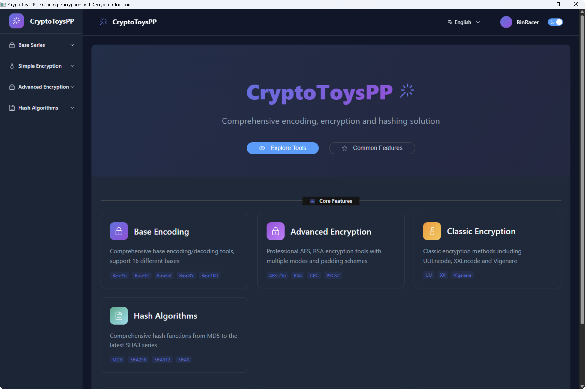
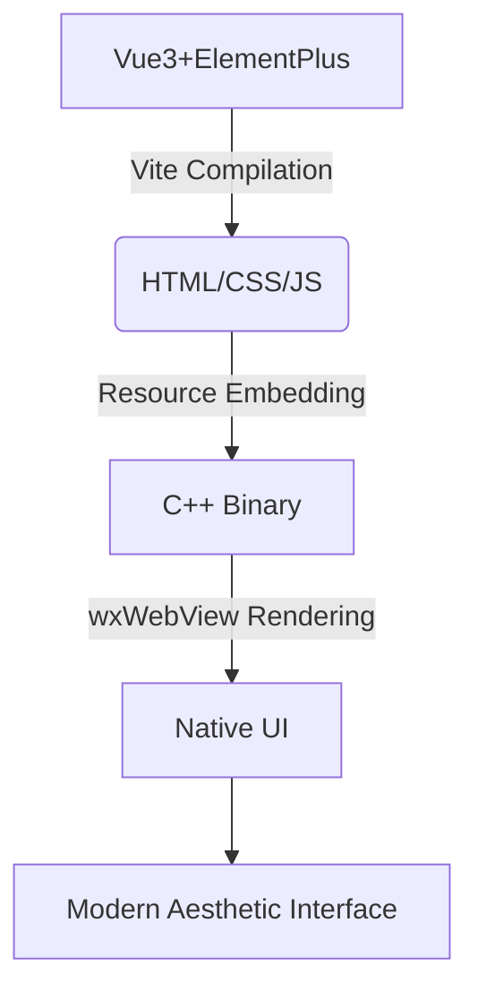
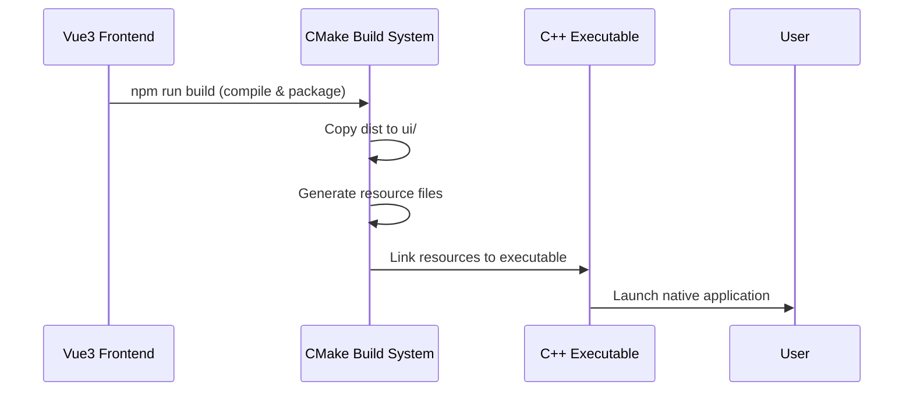

<div align="center">
  <!-- Banner with negative bottom margin -->
  <a href="https://github.com/BinRacer/CryptoToysPP">
    
  </a>

  <!-- Main badges directly attached -->
  <div style="margin-top:-3rem; line-height:1; padding:0">
    
    
    
    
    
    
  </div>
</div>

<div align="center">

English | [简体中文](./README.zh-CN.md)

</div>

---

### 🚀 Core Architecture

CryptoToysPP is a **high-performance modern cryptography toolkit** featuring:

- **C++20 + Crypto++8.9 core algorithm implementation**
- **Vue3 + wxWebView frontend rendering**
- **Native-level performance with modern aesthetic interface** 🎨✨

Static resources embedded in executables deliver desktop application-grade responsiveness.

---

<div style="text-align: center; margin: 2rem 0;">
  <p><em>CryptoToysPP Modern Aesthetic Interface Design</em></p>
  
</div>

---

## 🌟 Core Feature Highlights

### 🔤 Encoding Algorithms

| Encoding Type       | Supported Formats                             |
|---------------------|-----------------------------------------------|
| **Base Series**     | Base16/32/58/62/64/64URL/85/91/92/100         |
| **Simple Encoding** | UU Encoding · XX Encoding · Vigenere Encoding |

### 🔐 Encryption Algorithms

- **Advanced Encryption**:
    - AES (supports ECB, CBC, OFB, CFB, XTS, CCM, EAX, GCM modes, 6 padding schemes)
    - RSA (key generation/encryption/decryption for 512/1024/2048/3072/4096-bit keys)

### 🔒 Hashing Algorithms

- **MD Series**: MD2, MD4, MD5
- **SHA1 Series**: SHA1, SHA224, SHA256, SHA384, SHA512
- **SHA3 Series**: SHA3-224, SHA3-256, SHA3-384, SHA3-512

## 🧩 Technical Architecture

### 🖼️ Project Architecture Design



### 🚀 Backend High-Performance Engine

| Component         | Version | Functionality                                                    |
|-------------------|---------|------------------------------------------------------------------|
| **wxWidgets**     | 3.3+    | Cross-platform GUI framework (WebView component support)         |
| **Crypto++**      | 8.9+    | Industrial-grade implementation of 100+ cryptographic algorithms |
| **nlohmann JSON** | 3.12+   | High-performance JSON configuration & data processing            |
| **spdlog**        | 1.15+   | Millisecond-response high-performance logging system             |
| **CMake**         | 3.30+   | Intelligent cross-platform build system                          |

## 🛠️ Build & Deployment Guide

### 🔧 System Dependency Installation

```bash
# Ubuntu/Debian (Ubuntu 22.04+ recommended)
sudo apt update && sudo apt install -y \
  build-essential cmake \
  libwxgtk-webview3.2-dev \
  libcrypto++-dev

# macOS (Homebrew recommended)
brew update && brew install \
  cmake wxwidgets \
  cryptopp spdlog nlohmann-json

# Windows (vcpkg recommended)
git clone https://github.com/microsoft/vcpkg.git
cd vcpkg
.\bootstrap-vcpkg.bat
.\vcpkg install wxwidgets cryptopp spdlog nlohmann-json
```

### 🚀 One-Command Build

```bash
# 1. Prepare build environment
mkdir -p build && cd build

# 2. Configure project (enable high optimization)
cmake -DCMAKE_BUILD_TYPE=Release .. 

# 3. Multi-threaded compilation (8-core CPU optimization)
cmake --build . --config Release -j8

# 4. Run application
./CryptoToysPP  # Linux/macOS
.\Release\CryptoToysPP.exe  # Windows
```

## 🔍 Project Structure Overview

```
CryptoToysPP/
├── CMakeLists.txt
├── images/
├── LICENSE
├── README.md
├── README.zh-CN.md
├── build                         # Executables and runtime dependencies (auto-generated)
│    ├── Debug                    
│    └── Release
├── scripts/
│    ├── copy_build_output.py     # 🔄 Resource generator
│    └── generate_resources.py    # 📁 Build deployment assistant
├── src
│    ├── algorithm/               # Algorithm core
│    │    ├── advance/            # AES, RSA algorithms
│    │    ├── base/               # Base-series encoding
│    │    ├── hash/               # Hashing algorithms
│    │    └── simple/             # Simple encoding (UU/XX/Vigenère)
│    ├── gui/                     # 🖥️ wxWidgets UI components
│    ├── resources/               # Embedded resources (auto-generated)  
│    │    ├── resources.cpp
│    │    └── resources.h
│    ├── route/                   # Routing
│    ├── main.cpp                 # Program entry
└── ui                            # Frontend static assets
    └── assets/
    ├── favicon.ico
    └── index.html
```

## ♻️ Workflow



## ✨ Feature Demonstrations

### 🔑 AES-CBC Encryption & Decryption

---

<div style="text-align: center; margin: 2rem 0;">
  <p><em>AES-CBC Encryption</em></p>
  
</div>
<div style="text-align: center; margin: 2rem 0;">
  <p><em>AES-CBC Decryption</em></p>
  
</div>

---

### 🔑 RSA-OAEP Encryption & Decryption

---

<div style="text-align: center; margin: 2rem 0;">
  <p><em>RSA-OAEP Encryption</em></p>
  
</div>
<div style="text-align: center; margin: 2rem 0;">
  <p><em>RSA-OAEP Decryption</em></p>
  
</div>

---

### 🌈 Modern UI Rendering Core

```cpp
// Create WebView renderer
void MainFrame::InitWebView() {
    spdlog::debug("Initializing WebView...");

    // Selecting WebView backend
    wxString backend = wxWebViewBackendDefault;
    if (wxWebView::IsBackendAvailable(wxWebViewBackendEdge)) {
        backend = wxWebViewBackendEdge;
        spdlog::debug("Selected backend: Edge WebView");
    } else if (wxWebView::IsBackendAvailable(wxWebViewBackendWebKit)) {
        backend = wxWebViewBackendWebKit;
        spdlog::debug("Selected backend: WebKit");
    } else {
        spdlog::debug("Using default backend");
    }

    // Creating WebView component
    webview = wxWebView::New(this, wxID_ANY, "", wxDefaultPosition,
                             wxSize(WINDOW_WIDTH, WINDOW_HEIGHT), backend,
                             wxBORDER_NONE);

    if (!webview) {
        spdlog::error("WebView creation failed");
        Close(true);
        return;
    }
    spdlog::info("WebView created successfully");

    // Configuring WebView features
    webview->RegisterHandler(
            wxSharedPtr<wxWebViewHandler>(new Route::SchemeHandler()));
    spdlog::debug("Registered custom scheme handler");

    webview->SetUserAgent(
            "Mozilla/5.0 (Windows NT 10.0; Win64; x64) AppleWebKit/537.36 "
            "(KHTML, like Gecko) Chrome/122.0.0.0 Safari/537.36");
    spdlog::debug("User agent configured");

    // Binding event handlers
    webview->Bind(wxEVT_WEBVIEW_SCRIPT_MESSAGE_RECEIVED,
                      &MainFrame::OnScriptMessage, this);
    webview->AddScriptMessageHandler("CryptoToysPP");
    spdlog::info("Registered script handler: CryptoToysPP");

    webview->Bind(wxEVT_WEBVIEW_ERROR, &MainFrame::OnWebViewError, this);
    webview->Bind(wxEVT_WEBVIEW_LOADED, &MainFrame::OnWebViewLoaded, this);

    // Initial configuration
    webview->LoadURL("app://index.html");
    spdlog::info("Loading initial page: app://index.html");

    webview->EnableContextMenu(true);
    webview->EnableAccessToDevTools(true);
    spdlog::debug("Developer tools enabled");

    SetSize(WINDOW_WIDTH, WINDOW_HEIGHT);
    Center();
    Show();
    spdlog::info("Main window displayed");
}
```

## 📜 MIT Open Source License
