<div align="center">

<h1>
  <span style="display: inline-block; background: linear-gradient(135deg, #4361ee, #7209b7); 
             -webkit-background-clip: text; background-clip: text; color: transparent;
             font-size: 3.5rem; font-weight: 800;">
    CryptoToysPP
  </span>
  <span style="font-size: 2.8rem; color: #4361ee; vertical-align: middle;">✨</span>
</h1>

<p style="font-size: 1.2rem; margin-top: 0.5rem; color: #6c757d;">
  Comprehensive Encoding Conversion, Encryption, and Hashing Solutions
</p>

<div style="margin: 1.5rem 0;">
  
  
  
  
  
  
</div>

<div>
  
  
</div>

</div>
<div align="center">

[English](./README.md) | 简体中文

</div>

---

### 🚀 核心架构

CryptoToysPP 是**高性能现代密码学工具套件**，采用：

- **C++20 + Crypto++8.9 实现核心算法**
- **Vue3 + wxWebView 渲染前端**
- **原生级性能的现代美学界面** 🎨✨

静态资源嵌入可执行文件，实现桌面应用的极致响应速度。

---

<div style="text-align: center; margin: 2rem 0;">
  <p><em>CryptoToysPP 现代美学界面设计</em></p>
  
</div>

---

## 🌟 核心功能亮点

### 🔤 编码算法

| 编码类型       |                 支持格式                  |
|------------|:-------------------------------------:|
| **Base系列** | Base16/32/58/62/64/64URL/85/91/92/100 |
| **简单编码**   |       UU编码 · XX编码 · Vigenere编码        |

### 🔐 加密算法

- **高级加密**：
    - AES（支持ECB、CBC、OFB、CFB、XTS、CCM、EAX、GCM等工作模式，6种填充方式）
    - RSA（512、1024、2048、3072、4096等长度密钥生成、加密解密）

### 🔒 哈希算法

- **MD系列**：MD2、MD4、MD5
- **SHA1系列**：
    - SHA1、SHA224、SHA256、SHA384、SHA512
- **SHA3系列**：
    - SHA3-224、SHA3-256、SHA3-384、SHA3-512

## 🧩 技术架构

### 🖼️ 项目架构设计

```mermaid
flowchart TD
    A[Vue3+ElementPlus] -->|Vite编译打包| B(HTML/CSS/JS)
    B -->|资源嵌入| C[C++二进制]
    C -->|wxWebView渲染| D[原生UI]
    D --> E[现代美学界面]
```



### 🚀 后端高性能引擎

| 组件                | 版本    | 功能                    |
|-------------------|-------|-----------------------|
| **wxWidgets**     | 3.3+  | 跨平台GUI框架（支持WebView组件） |
| **Crypto++**      | 8.9+  | 超过100种密码学算法的工业级实现     |
| **nlohmann JSON** | 3.12+ | 高性能JSON配置和数据处理        |
| **spdlog**        | 1.15+ | 毫秒级响应的高性能日志系统         |
| **CMake**         | 3.30+ | 智能化跨平台构建系统            |

## 🛠️ 构建与部署指南

### 🔧 系统依赖安装

```bash
# Ubuntu/Debian（推荐使用Ubuntu 22.04+）
sudo apt update && sudo apt install -y \
  build-essential cmake \
  libwxgtk-webview3.2-dev \
  libcrypto++-dev

# macOS（推荐使用Homebrew）
brew update && brew install \
  cmake wxwidgets \
  cryptopp spdlog nlohmann-json

# Windows（推荐使用vcpkg）
git clone https://github.com/microsoft/vcpkg.git
cd vcpkg
.\bootstrap-vcpkg.bat
.\vcpkg install wxwidgets cryptopp spdlog nlohmann-json
```

### 🚀 一键构建命令

```bash
# 1. 准备构建环境
mkdir -p build && cd build

# 2. 配置项目（启用高优化级别）
cmake -DCMAKE_BUILD_TYPE=Release .. 

# 3. 多线程编译（8核处理器速度优化）
cmake --build . --config Release -j8

# 4. 运行应用程序
./CryptoToysPP  # Linux/macOS
.\Release\CryptoToysPP.exe  # Windows
```

## 🔍 项目结构全景

```
CryptoToysPP/
├── CMakeLists.txt
├── images/
├── LICENSE
├── README.md
├── README.zh-CN.md
├── build                         # 可执行文件及其运行时依赖（自动生成） 
│    ├── Debug                    
│    └── Release
├── scripts/
│    ├── copy_build_output.py     # 🔄 资源生成器
│    └── generate_resources.py    # 📁 构建部署助手
├── src
│    ├── algorithm/               # 算法核心
│    │    ├── advance/            # AES、RSA算法
│    │    ├── base/               # Base系列编码
│    │    ├── hash/               # 哈希系列算法
│    │    └── simple/             # 简单编码（UU/XX/Vigenere）
│    ├── gui/                     # 🖥️ wxWidgets UI组件
│    ├── resources/               # 内嵌资源（自动生成）  
│    │    ├── resources.cpp
│    │    └── resources.h
│    ├── route/                   # 路由
│    ├── main.cpp                 # 程序入口
└── ui                            # 前端静态资源
    └── assets/
    ├── favicon.ico
    └── index.html
```

## ♻️ 工作流

```mermaid
sequenceDiagram
    participant Vue as Vue3前端
    participant CMake as CMake构建系统
    participant App as C++可执行文件
    Vue ->> CMake: npm run build (编译打包)
    CMake ->> CMake: 复制dist到ui/
    CMake ->> CMake: 生成资源文件
    CMake ->> App: 链接资源到可执行文件
    App ->> 用户: 启动原生应用
```



## ✨ 功能演示

### 🔑 AES-CBC 加密解密

---

<div style="text-align: center; margin: 2rem 0;">
  <p><em>AES-CBC 加密</em></p>
  
</div>
<div style="text-align: center; margin: 2rem 0;">
  <p><em>AES-CBC 解密</em></p>
  
</div>

---

### 🔑 RSA-OAEP 加密解密

---

<div style="text-align: center; margin: 2rem 0;">
  <p><em>RSA-OAEP 加密</em></p>
  
</div>
<div style="text-align: center; margin: 2rem 0;">
  <p><em>RSA-OAEP 解密</em></p>
  
</div>

---

### 🌈 现代UI渲染核心

```cpp
// 创建WebView渲染器
void MainFrame::InitWebView() {
    spdlog::debug("Initializing WebView...");

    // Selecting WebView backend
    wxString backend = wxWebViewBackendDefault;
    if (wxWebView::IsBackendAvailable(wxWebViewBackendEdge)) {
        backend = wxWebViewBackendEdge;
        spdlog::debug("Selected backend: Edge WebView");
    } else if (wxWebView::IsBackendAvailable(wxWebViewBackendWebKit)) {
        backend = wxWebViewBackendWebKit;
        spdlog::debug("Selected backend: WebKit");
    } else {
        spdlog::debug("Using default backend");
    }

    // Creating WebView component
    webview = wxWebView::New(this, wxID_ANY, "", wxDefaultPosition,
                             wxSize(WINDOW_WIDTH, WINDOW_HEIGHT), backend,
                             wxBORDER_NONE);

    if (!webview) {
        spdlog::error("WebView creation failed");
        Close(true);
        return;
    }
    spdlog::info("WebView created successfully");

    // Configuring WebView features
    webview->RegisterHandler(
            wxSharedPtr<wxWebViewHandler>(new Route::SchemeHandler()));
    spdlog::debug("Registered custom scheme handler");

    webview->SetUserAgent(
            "Mozilla/5.0 (Windows NT 10.0; Win64; x64) AppleWebKit/537.36 "
            "(KHTML, like Gecko) Chrome/122.0.0.0 Safari/537.36");
    spdlog::debug("User agent configured");

    // Binding event handlers
    webview->Bind(wxEVT_WEBVIEW_SCRIPT_MESSAGE_RECEIVED,
                      &MainFrame::OnScriptMessage, this);
    webview->AddScriptMessageHandler("CryptoToysPP");
    spdlog::info("Registered script handler: CryptoToysPP");

    webview->Bind(wxEVT_WEBVIEW_ERROR, &MainFrame::OnWebViewError, this);
    webview->Bind(wxEVT_WEBVIEW_LOADED, &MainFrame::OnWebViewLoaded, this);

    // Initial configuration
    webview->LoadURL("app://index.html");
    spdlog::info("Loading initial page: app://index.html");

    webview->EnableContextMenu(true);
    webview->EnableAccessToDevTools(true);
    spdlog::debug("Developer tools enabled");

    SetSize(WINDOW_WIDTH, WINDOW_HEIGHT);
    Center();
    Show();
    spdlog::info("Main window displayed");
}
```

## 📜 MIT开源许可
